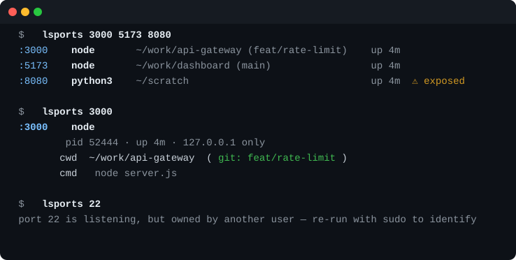

# lsports

[](https://github.com/NagendraKammari/lsports/actions/workflows/ci.yml)
[](https://crates.io/crates/lsports)

See what's listening on your ports — and why it's there.

`lsof -nP -iTCP:3000 -sTCP:LISTEN` tells you a `node` process holds port 3000.
It does not tell you *which* of your six checkouts it came from, when it
started, or how it got launched — which is what you actually wanted to know.



Same data everyone else has, plus the context that identifies the process.

## Install

```console
cargo install lsports
```

Or download a binary for macOS, Linux or Windows from
[Releases](https://github.com/NagendraKammari/lsports/releases).

## Use

```console
$ lsports                  # everything you can see
$ lsports 3000             # one port, in detail
$ lsports 3000 8080        # several ports
$ lsports --long           # full detail for every row
$ lsports --json           # machine-readable
$ lsports --color always   # keep colour when piping, e.g. into `less -R`
```

### It tells you when a port is exposed

A dev server bound to `0.0.0.0` is reachable by everyone on your network — the
coffee shop wifi included. That gets its own marker rather than being buried in
an address column:

```console
:8080  python3  ~/scratch                             up 4m ⚠ exposed
```

### It admits what it cannot see

Without root, the kernel will not say which process owns another user's socket,
so roughly half the listeners on a typical machine are unattributable. Worse,
socket enumeration omits them entirely rather than reporting them anonymously —
which makes "nothing is listening on port 22" a lie. `lsports` cross-checks and
distinguishes the two cases:

```console
$ lsports 22
port 22 is listening, but owned by another user — re-run with sudo to identify

$ lsports 9999
nothing is listening on port 9999
```

## Compared to what you're using now

|  | `lsof` / `netstat` | `lsports` |
|---|---|---|
| port → pid | yes | yes |
| working directory | no | yes |
| git branch | no | yes |
| uptime | via `ps`, separately | yes |
| launch chain | no | yes |
| exposed-binding warning | no | yes |
| distinguishes "free" from "hidden" | no | yes |
| memorable invocation | `lsof -nP -iTCP:3000 -sTCP:LISTEN` | `lsports 3000` |

## Notes

- **Platforms:** macOS, Linux and Windows, each built and smoke-tested in CI
  against the runner's real sockets. The "N more sockets" and blocked-port
  cross-checks shell out to `ss` or `netstat` and so are Unix-only; on Windows
  those two lines are simply absent.
- **Git branch** is read from `.git/HEAD` directly, and is deliberately *not*
  reported when the enclosing repository is a package manager's own checkout.
  A redis server whose cwd is `/opt/homebrew/var/db/redis` sits inside
  Homebrew's git repo, and calling that "branch: stable" is worse than saying
  nothing.
- **Launch chain** (`via npm ← zsh`) only appears for processes still attached
  to their parent. Daemons get reparented to init/launchd, and "parent:
  launchd" is not worth a line.
- **Location** shows `—` when a process's cwd is `/` or `$HOME`: those are
  inherited defaults, not somewhere the process chose to be. `--json` still
  reports the raw value.
- **TCP only** for now.
- **MSRV** 1.86.

## Roadmap

- `lsports free 3000` — graceful `SIGTERM`, confirm before `SIGKILL`
- `lsports --wait-for-free 3000` — block until a port is released, for scripts
- container attribution (Docker, Colima, Podman)
- UDP

## License

MIT
